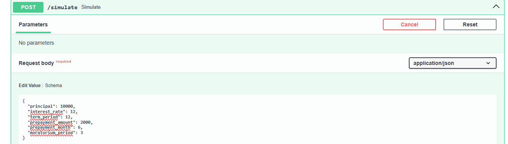
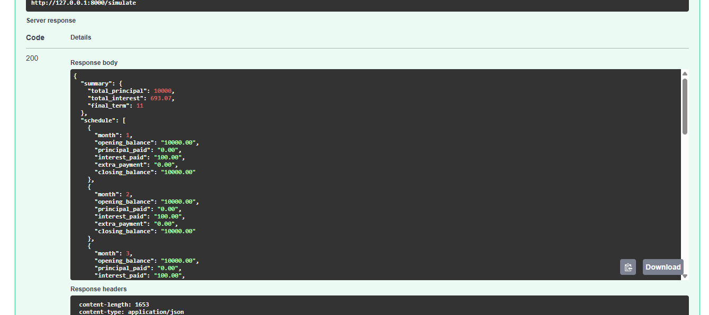

Mifos Intelligent Loan Simulator

An AI-ready microservice built with FastAPI to provide advanced "What-if" loan simulations for the Mifos/Apache Fineract ecosystem.

Key Features:

Declining Balance Engine: Accurate financial math using Python's Decimal library for bank-grade precision.

"What-if" Prepayments: Simulate how extra principal payments in a specific month reduce the total interest and loan term.

Moratorium Support: Handles "payment holidays" where principal repayment is deferred for a set period.

Automated Amortization: Generates a full month-by-month schedule including opening balance, interest, principal, and closing balance.

### 📸 Simulator Demo

**1. Input Scenario**
(10k Loan, 12% Interest, 3-month Moratorium, $2,000 Prepayment in Month 6)

**2. Generated Schedule**
(Shows the 0 principal during moratorium and the impact of the prepayment)

Tech Stack:

Language: Python 3.10+

Framework: FastAPI

Documentation: Swagger UI (OpenAPI)

Example Simulation:

Scenario: $10,000 loan at 12% interest for 12 months with a $2,000 prepayment in Month 5.

Result: The loan is paid off in 10 months instead of 12.

Savings: Total interest reduced from ~$661 to $533.53.
